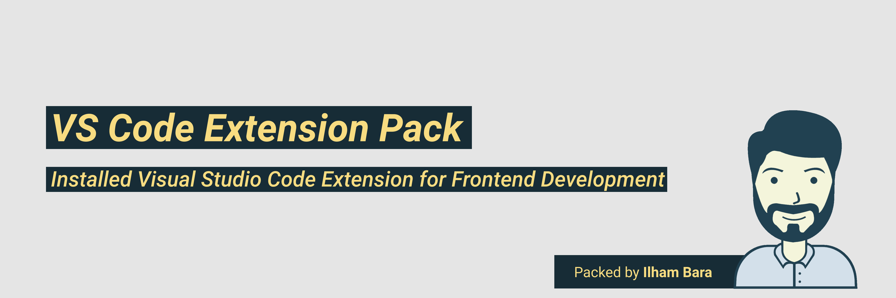

## bara-js-extension-pack"

> All Installed VS Code Extension Mostly for Frontend Web Development.
> This Version is 0.1.0

## What's included in this Extension Pack?

* Tailwind CSS IntelliSense
* Bracket Pair Colorizer
* ESLint
* ES7 React/Redux/GraphQL/React-Native snippets
* Community Material Theme
* Prettier - Code formatter
* Auto Rename Tag
* Discord Presence
* vscode-styled-components
* Vetur
* Material Icon Theme
* Live Sass Compiler
* Live Server
* open in browser
* IntelliSense for CSS class names in HTML

## For more information

* [Visual Studio Code's Marketplace](https://marketplace.visualstudio.com/items?itemName=BaraJS.extension-pack)
* [Markdown Syntax Reference](https://help.github.com/articles/markdown-basics/)
